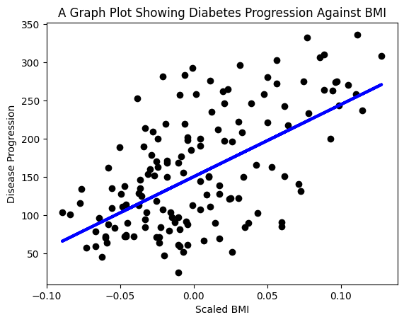
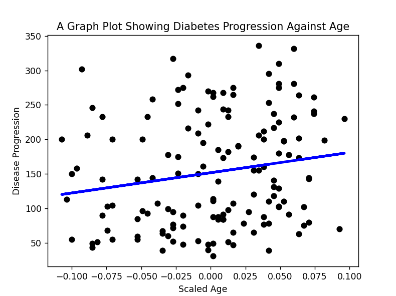
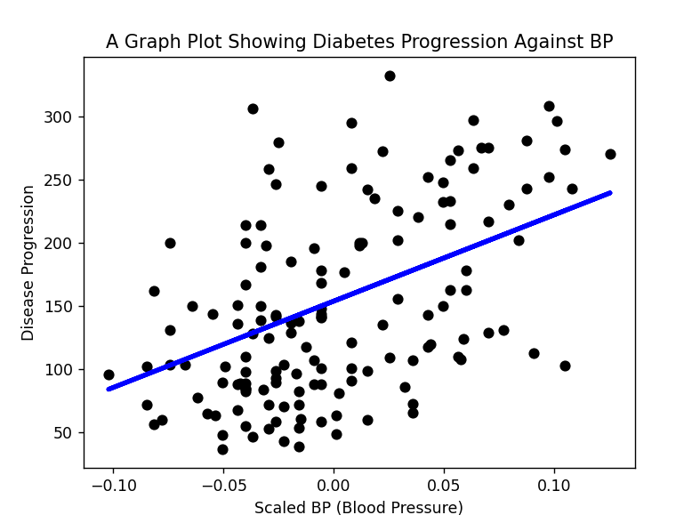
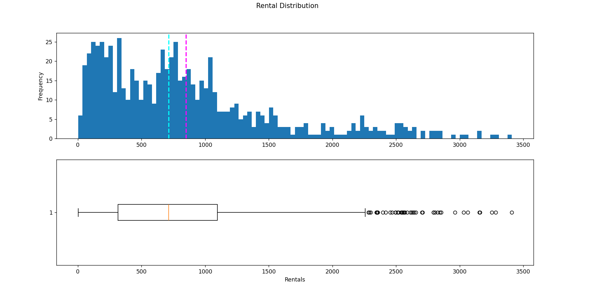

# Regression Models

### Linear Regression Model
Building the first **linear regression model**, created a prediction with it, and displayed it in a plot!  
Please refer [this](./notebook.ipynb) Notebook for step by step explaination.  
[Python Program Link](./diabetes_progression.py)  
  
    
      

### Regression: number of rentals based on Seasonality and Weather conditions
We'll focus on regression, using an example based on a real study in which data for a bicycle sharing scheme was collected and used to predict the number of rentals based on seasonality and weather conditions.  
The data we used in this exercise is derived from [Capital Bikeshare](https://www.capitalbikeshare.com/system-data) and it's used in accordance with the published license agreement.  
[Python Program](./bike_rentals.py)   
  